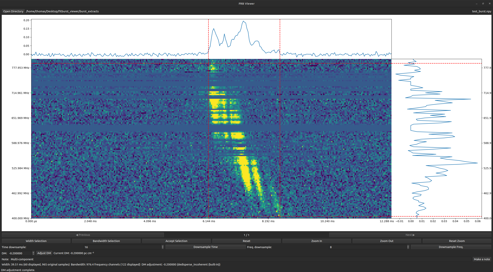

# FRB Viewer

A small Python/PySide6 GUI for browsing `.npy` fast-radio-burst dynamic spectra.



## Install

```bash
python -m pip install numpy matplotlib PySide6
```

## Run

```bash
python frb_viewer.py /path/to/directory
```

Or simply:

```bash
python frb_viewer.py
```

and choose a directory from the GUI.

The directory should contain `.npy` files with shape:

```text
(n_frequency, n_time)
```

Each burst is assumed to be centered in its file.

## Features

- Previous / Next burst navigation
- Dynamic spectrum plot
- Time series plot
- Frequency spectrum plot
- Interactive width selection
- Interactive bandwidth selection
- Time downsampling
- Frequency downsampling
- Reset chosen parameters
- Zoom in/out
- Zoom reset
- DM adjustment
- Customized burst notes

## Output

The application writes everything to a dictionary that used the burst's file name as a key and stores all of the inputted parameters as values. See the  for an example. 

## Feedback
Any questions can be directed to Thomas Abbott: thomas.abbott@mail.mcgill.ca. This repo made use of generative AI. 
